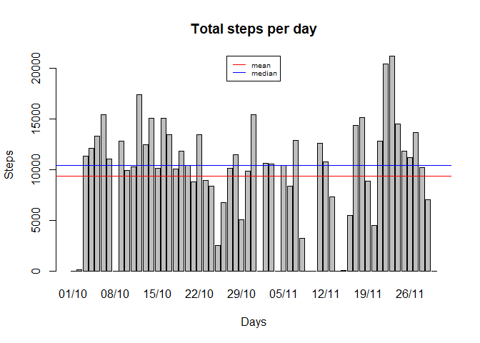
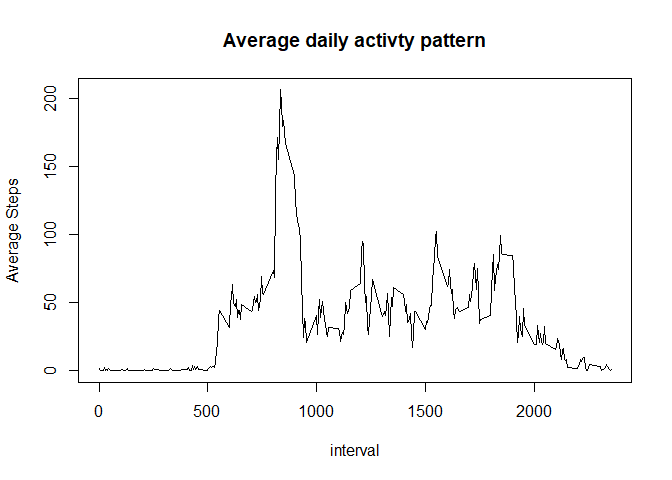
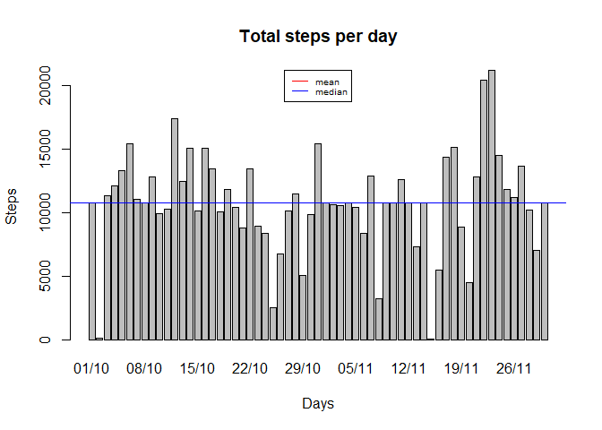
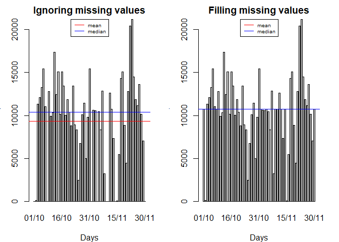

## Loading and preprocessing the data
With the following code I load the activity data and transform the date from a factor class to a date one.

```r
library(dplyr)
```

```
## 
## Attaching package: 'dplyr'
```

```
## The following objects are masked from 'package:stats':
## 
##     filter, lag
```

```
## The following objects are masked from 'package:base':
## 
##     intersect, setdiff, setequal, union
```

```r
unzip("activity.zip")
activity <- read.csv2("activity.csv", header=TRUE, sep = ",")
activity <- mutate(activity, date=as.Date(as.character(date), "%Y-%m-%d"))
str(activity)
```

```
## 'data.frame':	17568 obs. of  3 variables:
##  $ steps   : int  NA NA NA NA NA NA NA NA NA NA ...
##  $ date    : Date, format: "2012-10-01" "2012-10-01" ...
##  $ interval: int  0 5 10 15 20 25 30 35 40 45 ...
```

## What is mean total number of steps taken per day?
1. I need to group the activity data frame by date
2. Summarize the the date frame to get only the sum of steps per date (day)
3. Plot the total steps by date in a histogram
4. Get mean and median of steps per day

```r
activity_grp <- activity %>% group_by(date) #group the data frame by date
steps_day <- summarise(activity_grp, steps=sum(steps, na.rm = TRUE)) #sum the steps by date
stepsMean <- mean(steps_day$steps) #Finally get the mean of steps by day
stepsMedian <- median(steps_day$steps) #and median

#plot
barplot(steps_day$steps, names.arg = format(steps_day$date,"%d/%m"), xlab = "Days", ylab = "Steps", main = "Total steps per day")
abline(h=stepsMean, col="red")
abline(h=stepsMedian, col="blue")
legend("top", legend = c("mean", "median"), col = c("red", "blue"), lty=1, cex = 0.6)
```

<!-- -->
The steps mean per day are 9354.2295082 and 10395 is the median.

## What is the average daily activity pattern?
As in the previus analysis, I group the data frame and get the average steps for the 5-minute interval. The following plot show the pattern with the average steps along all days.

```r
interval_grp <- activity %>% group_by(interval)
steps_interval <- summarise(interval_grp, steps=mean(steps, na.rm = TRUE))
plot(steps_interval, type = "l", ylab="Average Steps", main="Average daily activty pattern")
```

<!-- -->

The maximun number of steps, on average across all the days in the dataset, are 206.1698113 and correspond to the interval 835

## Imputing missing values


```r
missing_values <- which(is.na(activity$steps))
```
So there are 2304 missing values.

If I replace the missing values with the average of the correponding 5-minute interval, how it would impact our first result.


```r
activity_fill <- activity #Save data frame to fill the NA
for (i in 1:length(missing_values)){
    missingInterval <- activity_fill$interval[missing_values[i]] #Get the interval of the missing value
    activity_fill[missing_values[i], 1] <- steps_interval$steps[missingInterval == steps_interval$interval] #Set the value of the mean steps of that interval
}

#Histogram of total number of steps per day
activity_grp1 <- activity_fill %>% group_by(date) #group the data frame by date
steps_day1 <- summarise(activity_grp1, steps=sum(steps, na.rm = TRUE)) #sum the steps by date
stepsMean1 <- mean(steps_day1$steps) #Finally get the mean of steps by day
stepsMedian1 <- median(steps_day1$steps) #and median
barplot(steps_day1$steps, names.arg = format(steps_day1$date,"%d/%m"), xlab = "Days", ylab = "Steps", main = "Total steps per day")
abline(h=stepsMean1, col="red")
abline(h=stepsMedian1, col="blue")
legend("top", legend = c("mean", "median"), col = c("red", "blue"), lty=1, cex = 0.6)
```

<!-- -->

So, the new steps mean per day is 1.0766189\times 10^{4} and 1.0766189\times 10^{4} is the median. And we can see that simply dufference is that the mean and median are the same in the last analysis.

In the next plot we can compare side by side the differences on the two approaches.

```r
par(mfrow=c(1,2), mar=c(4,3,2,2))
#ignoring missing values
barplot(steps_day$steps, names.arg = format(steps_day$date,"%d/%m"), xlab = "Days", ylab = "Steps", main = "Ignoring missing values")
abline(h=stepsMean, col="red")
abline(h=stepsMedian, col="blue")
legend("top", legend = c("mean", "median"), col = c("red", "blue"), lty=1, cex = 0.6)

#filling missing values
barplot(steps_day1$steps, names.arg = format(steps_day1$date,"%d/%m"), xlab = "Days", ylab = "Steps", main = "Filling missing values")
abline(h=stepsMean1, col="red")
abline(h=stepsMedian1, col="blue")
legend("top", legend = c("mean", "median"), col = c("red", "blue"), lty=1, cex = 0.6)
```

<!-- -->

## Are there differences in activity patterns between weekdays and weekends?

```r
library(ggplot2)
activity_fill$daytype <- ifelse(weekdays(activity_fill$date) %in% c("sábado", "domingo"), "weekend", "weekday")
activity_fill$daytype <- as.factor(activity_fill$daytype)

interval_grp1 <- activity_fill %>% group_by(daytype,interval)
steps_interval1 <- summarise(interval_grp1, steps=mean(steps, na.rm = TRUE))
qplot(interval, y=steps, data = steps_interval1, facets = daytype~., geom = "line")
```

<!-- -->

There are difference, the main difference is that in the weekdays there is a notorious peak, which correspond with the maximum steps found in the first intervla analysis.

Sergio Rodríguez

2018-04-08
